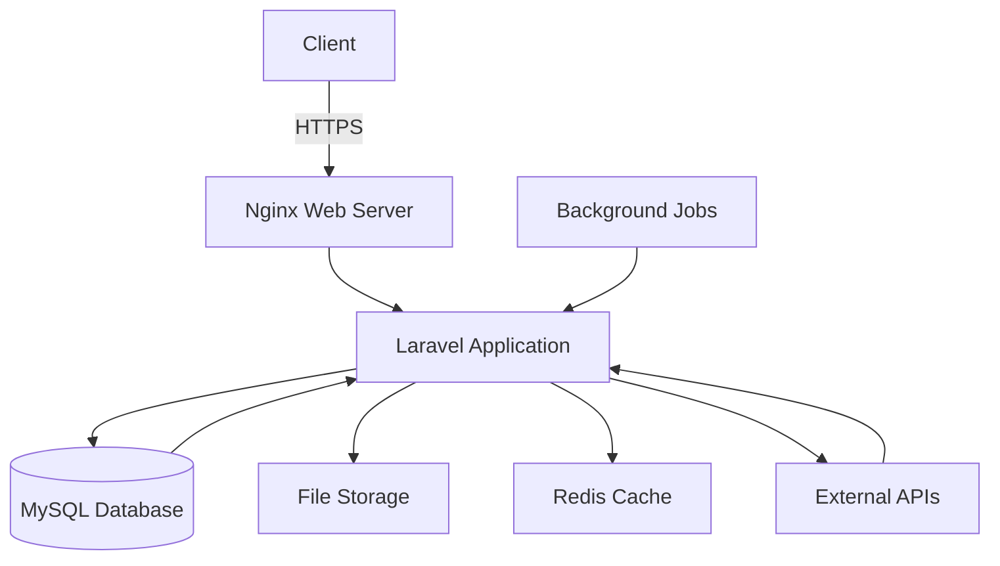

<div align="center">

# 🏗️ Asset Management System for NEEPCO

[](https://opensource.org/licenses/MIT)
[](https://laravel.com/)
[](https://php.net/)
[](https://vuejs.org/)
[](https://www.mysql.com/)
[](https://github.com/Pratik-Dev-Codes/Asset-Management-System-For-NEEPCO-LTD/stargazers)
[](https://github.com/Pratik-Dev-Codes/Asset-Management-System-For-NEEPCO-LTD/network/members)

A modern, comprehensive asset management solution built for **North Eastern Electric Power Corporation Limited (NEEPCO)** to efficiently track, manage, and maintain organizational assets.

<div align="center" style="margin: 1.5rem 0;">
  <a href="#-key-features" class="nav-link">✨ Features</a> •
  <a href="#-quick-start" class="nav-link">🚀 Quick Start</a> •
  <a href="#-tech-stack" class="nav-link">💻 Tech Stack</a> •
  <a href="#-documentation" class="nav-link">📚 Documentation</a> •
  <a href="#-contributing" class="nav-link">🤝 Contributing</a>
</div>

</div>

## 🌟 Introduction

Welcome to the **Asset Management System for NEEPCO**, a robust web application designed to streamline asset lifecycle management for one of India's premier power generation companies. This system provides a centralized platform for tracking assets, scheduling maintenance, generating reports, and ensuring compliance with organizational policies.

### 🎓 Academic Context
*Developed as a Final Year Project for Master's in Computer Application (MCA) at Royal Global University, Assam (2025)*

## 📋 Table of Contents
- [✨ Key Features](#-key-features)
- [🚀 Quick Start](#-quick-start)
- [💻 Tech Stack](#-tech-stack)
- [📚 Documentation](#-documentation)
- [🤝 Contributing](#-contributing)
- [📄 License](#-license)
- [👨‍💻 About the Developer](#-about-the-developer)

<style>
  .nav-link {
    margin: 0 10px;
    color: #0366d6;
    text-decoration: none;
    font-weight: 500;
  }
  .nav-link:hover {
    text-decoration: underline;
  }
  .feature-card {
    background: #f6f8fa;
    border-radius: 8px;
    padding: 1.5rem;
    margin: 1.5rem 0;
    border-left: 4px solid #0366d6;
    box-shadow: 0 1px 3px rgba(0,0,0,0.1);
  }
  .feature-card h3 {
    margin-top: 0;
    color: #24292e;
    border-bottom: 1px solid #e1e4e8;
    padding-bottom: 0.5rem;
    margin-bottom: 1rem;
  }
  .badge {
    display: inline-block;
    padding: 0.25em 0.5em;
    font-size: 0.875em;
    font-weight: 600;
    line-height: 1.5;
    color: #fff;
    text-align: center;
    white-space: nowrap;
    vertical-align: baseline;
    border-radius: 0.25rem;
    background-color: #0366d6;
    margin-right: 0.5rem;
    margin-bottom: 0.5rem;
  }
</style>

## ✨ Key Features

### 🏷️ Asset Management
<div class="feature-card">
  <div class="feature-content">
    <span class="badge">Core Feature</span>
    <p>Comprehensive tools for managing your organization's assets throughout their entire lifecycle.</p>
    
    <h4>Key Capabilities:</h4>
    <ul>
      <li>✅ <strong>Asset Tracking</strong> - Monitor assets with unique identifiers, QR codes, and barcodes</li>
      <li>🔄 <strong>Lifecycle Management</strong> - Track from procurement to decommissioning</li>
      <li>📊 <strong>Bulk Operations</strong> - Import/export assets using Excel/CSV with validation</li>
      <li>🏷️ <strong>Asset Categorization</strong> - Organize with custom fields and hierarchies</li>
      <li>📉 <strong>Depreciation Tracking</strong> - Automate financial calculations</li>
    </ul>
  </div>
</div>

### 🛠️ Maintenance Management
<div class="feature-card">
  <div class="feature-content">
    <span class="badge" style="background-color: #28a745;">Operations</span>
    <p>Streamline maintenance operations and reduce equipment downtime.</p>
    
    <h4>Key Capabilities:</h4>
    <ul>
      <li>🛡️ <strong>Preventive Maintenance</strong> - Schedule and track with automated reminders</li>
      <li>📋 <strong>Work Order System</strong> - Create, assign, and track with priorities</li>
      <li>📜 <strong>Maintenance History</strong> - Complete audit trail of activities</li>
      <li>⏱️ <strong>Downtime Tracking</strong> - Monitor asset availability metrics</li>
      <li>📱 <strong>Mobile Access</strong> - Update work orders on the go</li>
    </ul>
  </div>
</div>

### 📊 Analytics & Reporting
<div class="feature-card">
  <div class="feature-content">
    <span class="badge" style="background-color: #6f42c1;">Insights</span>
    <p>Make data-driven decisions with powerful reporting tools.</p>
    
    <h4>Key Capabilities:</h4>
    <ul>
      <li>📈 <strong>Custom Reports</strong> - Generate detailed asset and maintenance reports</li>
      <li>📱 <strong>Interactive Dashboards</strong> - Real-time KPIs and trends</li>
      <li>⏰ <strong>Scheduled Reports</strong> - Automate distribution via email</li>
      <li>📊 <strong>Performance Metrics</strong> - Track MTBF, MTTR, and more</li>
      <li>📤 <strong>Export Options</strong> - PDF, Excel, and CSV formats</li>
    </ul>
  </div>
</div>

### 🔐 Security & Compliance
<div class="feature-card">
  <div class="feature-content">
    <span class="badge" style="background-color: #dc3545;">Security</span>
    <p>Enterprise-grade security to protect your asset data.</p>
    
    <h4>Key Capabilities:</h4>
    <ul>
      <li>👥 <strong>Role-Based Access Control</strong> - Granular permissions</li>
      <li>🔑 <strong>Multi-factor Authentication</strong> - Enhanced account security</li>
      <li>📝 <strong>Audit Trails</strong> - Comprehensive activity logging</li>
      <li>🔒 <strong>Data Encryption</strong> - Industry-standard protection</li>
      <li>🌐 <strong>IP Whitelisting</strong> - Restrict access by location</li>
    </ul>
  </div>
</div>

## 🚀 Quick Start

Get your Asset Management System up and running in minutes with this step-by-step guide.

### 📋 Prerequisites

Before you begin, ensure you have the following installed:

<div class="feature-card" style="background-color: #f8f9fa; padding: 1.25rem;">
  <div class="prerequisites">
    <div class="prereq-item">
      <span class="badge" style="background-color: #777bb4;">PHP 8.1+</span>
      <span class="badge" style="background-color: #4479a1;">MySQL 5.7+</span>
      <span class="badge" style="background-color: #3e863d;">Node.js 16+</span>
      <span class="badge" style="background-color: #e44d26;">NPM 8+</span>
      <span class="badge" style="background-color: #4f5d95;">Composer 2.0+</span>
    </div>
  </div>
</div>

### 🛠️ Installation

Follow these steps to set up your development environment:

```bash
# 1. Clone the repository
git clone https://github.com/Pratik-Dev-Codes/Asset-Management-System-For-NEEPCO-LTD.git
cd Asset-Management-System-For-NEEPCO-LTD

# 2. Install PHP dependencies
composer install

# 3. Install JavaScript dependencies
npm install

# 4. Configure environment
cp .env.example .env
php artisan key:generate

# 5. Update database configuration in .env
# DB_CONNECTION=mysql
# DB_HOST=127.0.0.1
# DB_PORT=3306
# DB_DATABASE=asset_management
# DB_USERNAME=your_username
# DB_PASSWORD=your_password

# 6. Run database migrations and seed with sample data
php artisan migrate --seed

# 7. Compile frontend assets
npm run dev
# For production: npm run build

# 8. Start the development server
php artisan serve
```

### 🎉 Access the Application

Once the server is running, you can access the application at:

- **Local Development URL**: [http://localhost:8000](http://localhost:8000)

#### Default Admin Credentials:
- **Email**: admin@neepco.com
- **Password**: password

> ⚠️ **Security Note**: 
> - Change the default admin credentials immediately after first login
> - For production deployment, set `APP_ENV=production` and `APP_DEBUG=false` in your `.env` file
> - Configure proper database backups and security measures

### 🐳 Docker Support (Alternative)

If you prefer using Docker, you can use the included `docker-compose.yml`:

```bash
docker-compose up -d
```

This will set up:
- PHP 8.1 with necessary extensions
- MySQL 8.0
- Nginx web server
- Redis for caching

### 🔄 Updating the Application

To update to the latest version:

```bash
git pull origin main
composer install
npm install
php artisan migrate
npm run build
```

## 💻 Tech Stack

<div class="feature-card">
  <h3>🛠️ Core Technologies</h3>
  <div class="tech-stack">
    <div class="tech-category">
      <h4>Backend</h4>
      <div class="tech-items">
        <span class="badge" style="background-color: #777bb4;">PHP 8.1+</span>
        <span class="badge" style="background-color: #ff2d20;">Laravel 10</span>
        <span class="badge" style="background-color: #4479a1;">MySQL 8.0+</span>
      </div>
    </div>
    
    <div class="tech-category">
      <h4>Frontend</h4>
      <div class="tech-items">
        <span class="badge" style="background-color: #4fc08d;">Vue.js 3</span>
        <span class="badge" style="background-color: #000000;">Inertia.js</span>
        <span class="badge" style="background-color: #38bdf8;">Tailwind CSS</span>
      </div>
    </div>
  </div>
</div>

### 🖥️ Backend
- **PHP 8.1+** - Modern, fast, and secure server-side scripting language
- **Laravel 10** - Elegant PHP framework with expressive syntax
- **MySQL 8.0+** - Robust relational database management system
- **Laravel Sanctum** - Lightweight authentication system for SPAs and mobile apps
- **Laravel Excel** - Powerful Excel/CSV import/export functionality
- **Laravel Telescope** - Debugging assistant for local Laravel development
- **Laravel Horizon** - Beautiful dashboard and configuration system for Redis queues

### 🎨 Frontend
- **Vue.js 3** - Progressive JavaScript framework for building user interfaces
- **Inertia.js** - Modern approach to building classic server-driven web apps
- **Tailwind CSS** - Utility-first CSS framework for rapid UI development
- **Alpine.js** - Minimal framework for composing JavaScript behavior
- **Chart.js** - Simple yet flexible JavaScript charting
- **Vuex** - State management pattern + library for Vue.js applications

### 🛠️ Development Tools
- **Docker** - Container platform for simplified development environments
- **PHPStan** - PHP static analysis tool for finding bugs without running code
- **PHP_CodeSniffer** - PHP coding standard checker
- **Git** - Distributed version control system
- **GitHub Actions** - CI/CD pipeline for automated testing and deployment
- **VS Code** - Lightweight but powerful source code editor

### 📦 Dependencies

<details>
  <summary>View complete list of dependencies</summary>
  
  #### Backend (Composer)
  ```
  laravel/framework: ^10.0
  laravel/sanctum: ^3.2
  maatwebsite/excel: ^3.1
  laravel/telescope: ^4.0
  laravel/horizon: ^5.0
  ```
  
  #### Frontend (NPM)
  ```
  vue: ^3.2.0
  @inertiajs/vue3: ^1.0.0
  @inertiajs/progress: ^0.2.7
  @vitejs/plugin-vue: ^4.0.0
  tailwindcss: ^3.0.0
  chart.js: ^4.0.0
  ```
</details>

## 📚 Documentation

### 📐 System Architecture

#### High-Level Overview



#### 🧩 Core Components

1. **Asset Management**
   - Central module for asset CRUD operations
   - Barcode/QR code generation and scanning
   - Asset categorization and hierarchy management
   - Depreciation calculation and tracking

2. **Maintenance Module**
   - Preventive maintenance scheduling
   - Work order management
   - Maintenance history and reporting
   - Asset downtime tracking

3. **Reporting Engine**
   - Custom report builder
   - Scheduled reports
   - Export to multiple formats (PDF, Excel, CSV)
   - Dashboard widgets and analytics

4. **User Management**
   - Role-based access control (RBAC)
   - Multi-factor authentication
    <span class="badge" style="background-color: #2088ff;">GitHub</span>
  </div>
  
  <h4>📫 Get in Touch</h4>
  
  <p>
    <a href="mailto:pratik.dev.codes@gmail.com" style="text-decoration: none;">
       pratik.dev.codes@gmail.com
    </a>
  </p>
  
  <p>
    <a href="https://github.com/Pratik-Dev-Codes/Asset-Management-System-For-NEEPCO-LTD/issues" style="text-decoration: none;">
       Report an Issue
    </a>
  </p>
</div>

## 🚀 Future Enhancements

### 🛠️ Planned Features
- [ ] 📱 Mobile Application (React Native)
- [ ] 🌐 IoT Integration for real-time monitoring
- [ ] 🤖 Predictive Maintenance using ML
- [ ] 🔍 Barcode/QR Code scanning app
- [ ] 🌍 Multi-location support
- [ ] 📈 Advanced analytics with Power BI integration

### ⚙️ Technical Improvements
- [ ] 🔄 Implement API versioning
- [ ] ✅ Add comprehensive test coverage
- [ ] ⚡ Optimize database queries
- [ ] 🎯 Implement GraphQL API
- [ ] 🌙 Add dark mode support
### 📖 API Documentation

Explore our comprehensive API documentation for detailed information about available endpoints, request/response formats, and authentication methods.

#### Available API Endpoints:
- `GET /api/assets` - List all assets
- `POST /api/assets` - Create a new asset
- `GET /api/assets/{id}` - Get asset details
- `PUT /api/assets/{id}` - Update an asset
- `DELETE /api/assets/{id}` - Delete an asset
- `GET /api/maintenance` - List maintenance records
- `POST /api/maintenance` - Create maintenance record
- `GET /api/reports` - Generate reports

> **Note**: API documentation is also available via Swagger UI at `/api/documentation` when `APP_ENV=local`

## 🤝 Contributing

We welcome contributions from the community! Please read our [Contributing Guidelines](CONTRIBUTING.md) to get started.

### 🛠️ How to Contribute

1. 🍴 Fork the repository
2. 🌿 Create a feature branch (`git checkout -b feature/amazing-feature`)
3. 💾 Commit your changes (`git commit -m 'Add some amazing feature'`)
4. 📤 Push to the branch (`git push origin feature/amazing-feature`)
5. 🔄 Open a Pull Request

### 📝 Code Style
- Follow [PSR-12](https://www.php-fig.org/psr/psr-12/) coding standard
- Write meaningful commit messages

## 📄 License

This project is licensed under the MIT License - see the [LICENSE](LICENSE) file for details.

## 🙏 Acknowledgments

- Royal Global University, Assam for their guidance and support
- Laravel and Vue.js communities for amazing open-source tools
- NEEPCO for the opportunity to solve real-world challenges

---

<div align="center" style="margin-top: 2rem;">
  <p>Built with ❤️ using Laravel, Vue.js, and Tailwind CSS</p>
  
  <div style="margin: 1rem 0;">
    <a href="https://github.com/Pratik-Dev-Codes/Asset-Management-System-For-NEEPCO-LTD/stargazers" style="margin: 0 0.5rem;">
      
    </a>
    <a href="https://github.com/Pratik-Dev-Codes/Asset-Management-System-For-NEEPCO-LTD/network/members" style="margin: 0 0.5rem;">
      
    </a>
  </div>
  <p style="margin: 15px 0 0 0; font-size: 12px; color: #6a737d;">
    <a href="#top" style="color: #0366d6; text-decoration: none;">⬆️ Back to Top</a>
  </p>
</div>

<!-- GitHub Stats API Script -->
<script>
  // Fetch GitHub repository stats
  fetch('https://api.github.com/repos/Pratik-Dev-Codes/Asset-Management-System-For-NEEPCO-LTD')
    .then(response => response.json())
    .then(data => {
      if (data.stargazers_count !== undefined) {
        document.getElementById('github-stars').textContent = data.stargazers_count.toLocaleString();
      }
      if (data.forks_count !== undefined) {
        document.getElementById('github-forks').textContent = data.forks_count.toLocaleString();
      }
    })
    .catch(error => console.error('Error fetching GitHub stats:', error));
</script>

```bash
# Linux/macOS
chmod +x ./scripts/setup-dev.sh
./scripts/setup-dev.sh
```

This will install all required dependencies:
- Java Runtime Environment (JRE)
- Graphviz
- PlantUML
- Node.js and Husky for Git hooks

## Manual Generation (if needed)

```bash
# Generate all diagrams
php artisan docs:generate

# Or use the provided scripts
./docs/generate_diagrams.ps1  # Windows PowerShell
./docs/generate_diagrams.bat  # Windows CMD
```

> **Note**: Requires [PlantUML](https://plantuml.com/) and [Graphviz](https://graphviz.org/) to be installed.

## Prerequisites

- PHP 8.1 or higher
- Composer
- MySQL 5.7+ or MariaDB 10.3+
- Node.js & NPM

## 🧪 Testing

Run the test suite with:

```bash
php artisan test
```

## 📄 License

This project is licensed under the MIT License - see the [LICENSE](LICENSE) file for details.

## 🛡️ Code Quality

[](https://phpstan.org/)
[](https://www.php-fig.org/psr/psr-12/)
[](https://github.com/Pratik-Dev-Codes/Asset-Management/actions/workflows/laravel.yml)
