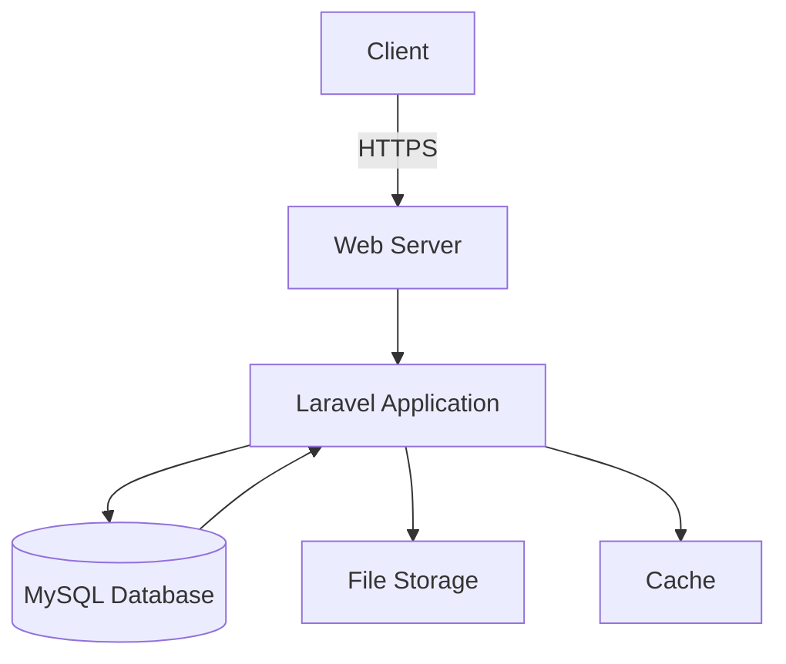

<div align="center">

# 🏗️ Asset Management System for NEEPCO

[](https://opensource.org/licenses/MIT)
[](https://laravel.com/)
[](https://php.net/)
[](https://vuejs.org/)
[](https://github.com/Pratik-Dev-Codes/Asset-Management-System-For-NEEPCO-LTD/stargazers)

A modern, comprehensive asset management solution built for **North Eastern Electric Power Corporation Limited (NEEPCO)** to efficiently track, manage, and maintain organizational assets.

[🚀 Live Demo](#) • 
[📚 Documentation](#-documentation) • 
[💡 Features](#-key-features) • 
[🛠️ Installation](#-installation) • 
[📦 Tech Stack](#-tech-stack)

</div>

## 🌟 Introduction

Welcome to the **Asset Management System for NEEPCO**, a robust web application designed to streamline asset lifecycle management for one of India's premier power generation companies. This system provides a centralized platform for tracking assets, scheduling maintenance, generating reports, and ensuring compliance with organizational policies.

### 🎓 Academic Context
*Developed as a Final Year Project for Master's in Computer Application (MCA) at Royal Global University, Assam (2025)*

## 🎯 Key Features

### 🏷️ Comprehensive Asset Management
- **Asset Tracking** - Monitor assets with unique identifiers, QR codes, and barcodes for easy scanning and management
- **Lifecycle Management** - Track complete asset lifecycle from procurement, assignment, maintenance, to decommissioning and disposal
- **Bulk Operations** - Import/export assets using Excel/CSV with data validation and error reporting
- **Asset Categorization** - Organize assets into categories and subcategories with custom fields
- **Depreciation Tracking** - Automatically calculate and track asset depreciation over time

### 🛠️ Maintenance & Work Orders
- **Preventive Maintenance** - Schedule and track regular maintenance tasks with automated reminders
- **Corrective Maintenance** - Log and manage unplanned maintenance activities
- **Work Order System** - Create, assign, and track work orders with priority levels and deadlines
- **Downtime Tracking** - Monitor and report on asset availability and performance metrics
- **Maintenance History** - Complete audit trail of all maintenance activities and costs

### 📊 Advanced Reporting & Analytics
- **Custom Reports** - Generate detailed reports on asset status, maintenance history, and costs
- **Analytics Dashboard** - Interactive dashboards with key performance indicators and trends
- **Export Capabilities** - Export reports in multiple formats (PDF, Excel, CSV) for further analysis
- **Scheduled Reports** - Automate report generation and distribution via email
- **Asset Performance Metrics** - Track MTBF, MTTR, and other key maintenance metrics

### 🔐 Access Control & Security
- **Role-Based Access Control** - Define user roles with granular permissions (Admin, Manager, Technician, Viewer)
- **Multi-factor Authentication** - Enhanced security with 2FA support
- **Audit Trails** - Comprehensive logging of all system activities and changes
- **Data Encryption** - Secure sensitive data with industry-standard encryption
- **IP Whitelisting** - Restrict access to specific IP addresses or ranges

### 🌐 Modern User Interface
- **Responsive Design** - Fully responsive interface that works on desktops, tablets, and mobile devices
- **Interactive Dashboards** - Real-time data visualization with charts, graphs, and widgets
- **Intuitive Navigation** - User-friendly interface with breadcrumbs and quick access menus
- **Dark/Light Mode** - Toggle between color schemes for comfortable viewing
- **Keyboard Shortcuts** - Improve productivity with keyboard navigation

### 🔄 Integration Capabilities
- **RESTful API** - Seamless integration with other business systems
- **Webhooks** - Real-time notifications for system events
- **Third-party Integrations** - Connect with popular tools like Slack, Microsoft Teams, and more
- **Single Sign-On (SSO)** - Support for enterprise authentication systems
- **Mobile App** - Companion mobile application for on-the-go access

### 📱 Mobile Features
- **Barcode/QR Scanning** - Use device camera to quickly identify assets
- **Offline Mode** - Access critical information without internet connection
- **Push Notifications** - Instant alerts for important updates and tasks
- **Photo Attachments** - Capture and attach photos to work orders and assets
- **Digital Signatures** - Capture approvals and verifications in the field

## 🚀 Quick Start

### Prerequisites
- PHP 8.1+
- MySQL 5.7+ or MariaDB 10.3+
- Node.js 16+ & NPM 8+
- Composer 2.0+

### Installation

1. **Clone the repository**
   ```bash
   git clone https://github.com/Pratik-Dev-Codes/Asset-Management-System-For-NEEPCO-LTD.git
   cd Asset-Management-System-For-NEEPCO-LTD
   ```

2. **Install PHP Dependencies**
   ```bash
   composer install
   ```

3. **Install JavaScript Dependencies**
   ```bash
   npm install
   ```

4. **Setup Environment**
   ```bash
   cp .env.example .env
   php artisan key:generate
   ```

5. **Configure Database**
   Update `.env` with your database credentials:
   ```env
   DB_CONNECTION=mysql
   DB_HOST=127.0.0.1
   DB_PORT=3306
   DB_DATABASE=asset_management_system
   DB_USERNAME=root
   DB_PASSWORD=
   ```

6. **Run Migrations & Seeders**
   ```bash
   php artisan migrate --seed
   ```

7. **Compile Assets**
   ```bash
   npm run dev
   # or for production
   # npm run build
   ```

8. **Start Development Server**
   ```bash
   php artisan serve
   ```

9. **Access the Application**
   - URL: http://localhost:8000
   - Admin Login:
     - Email: admin@neepco.com
     - Password: password

## 🛠 Tech Stack

### Backend
- **PHP 8.1+** - Core programming language
- **Laravel 10** - PHP framework
- **MySQL** - Relational database
- **Laravel Sanctum** - API authentication
- **Laravel Excel** - Data import/export
- **Laravel Telescope** - Debugging assistant

### Frontend
- **Vue.js 3** - Progressive JavaScript framework
- **Inertia.js** - Server-side routing
- **Tailwind CSS** - Utility-first CSS framework
- **Alpine.js** - Minimal framework for JavaScript behavior
- **Chart.js** - Data visualization

### Development Tools
- **Docker** - Containerization
- **PHPStan** - Static analysis
- **PHP_CodeSniffer** - Code style checking
- **Git** - Version control

## 📚 Documentation

### System Architecture

#### High-Level Overview


#### Core Components
1. **Asset Management** - Central module for asset CRUD operations
2. **Maintenance Module** - Scheduling and tracking maintenance
3. **Reporting Engine** - Custom report generation
4. **User Management** - Role-based access control
5. **API Layer** - RESTful endpoints for mobile/third-party integration

## 🚀 Future Enhancements

### Planned Features
- [ ] Mobile Application (React Native)
- [ ] IoT Integration for real-time monitoring
- [ ] Predictive Maintenance using ML
- [ ] Barcode/QR Code scanning app
- [ ] Multi-location support
- [ ] Advanced analytics with Power BI integration

### Technical Improvements
- [ ] Implement API versioning
- [ ] Add comprehensive test coverage
- [ ] Optimize database queries
- [ ] Implement GraphQL API
- [ ] Add dark mode support

## 🤝 Contributing

Contributions are welcome! Please follow these steps:

1. Fork the repository
2. Create your feature branch (`git checkout -b feature/AmazingFeature`)
3. Commit your changes (`git commit -m 'Add some AmazingFeature'`)
4. Push to the branch (`git push origin feature/AmazingFeature`)
5. Open a Pull Request

## 📄 License

This project is licensed under the MIT License - see the [LICENSE](LICENSE) file for details.

## 👨‍💻 About the Developer

<div align="center">
  
  
  ### Pratik Adhikary
  *MCA Final Year Student at Royal Global University, Assam*
  
  [](mailto:pratikadhikary.work@gmail.com)
  [](https://github.com/Pratik-Dev-Codes)
  [](https://linkedin.com/in/pratik-adhikary)
  
  "*This project represents my journey in mastering modern web development technologies and best practices during my Master's program.*"
</div>

## 🙏 Acknowledgments

- Royal Global University, Assam for their guidance and support
- Laravel and Vue.js communities for amazing open-source tools
- NEEPCO for the opportunity to solve real-world challenges

---

<div align="center">
  Made with ❤️ by Pratik Adhikary • 
  [](https://github.com/Pratik-Dev-Codes/Asset-Management-System-For-NEEPCO-LTD/stargazers)
  [](https://github.com/Pratik-Dev-Codes/Asset-Management-System-For-NEEPCO-LTD/network/members)
</div>
# Windows (PowerShell as Administrator)
Set-ExecutionPolicy Bypass -Scope Process -Force
.\scripts\setup-dev.ps1
```

```bash
# Linux/macOS
chmod +x ./scripts/setup-dev.sh
./scripts/setup-dev.sh
```

This will install all required dependencies:
- Java Runtime Environment (JRE)
- Graphviz
- PlantUML
- Node.js and Husky for Git hooks

## Manual Generation (if needed)

```bash
# Generate all diagrams
php artisan docs:generate

# Or use the provided scripts
./docs/generate_diagrams.ps1  # Windows PowerShell
./docs/generate_diagrams.bat  # Windows CMD
```

> **Note**: Requires [PlantUML](https://plantuml.com/) and [Graphviz](https://graphviz.org/) to be installed.

## Prerequisites

- PHP 8.1 or higher
- Composer
- MySQL 5.7+ or MariaDB 10.3+
- Node.js & NPM

## Installation

1. Clone the repository:
   ```bash
   git clone https://github.com/Pratik-Dev-Codes/Asset-Management.git
   cd Asset-Management
   ```

2. Install PHP dependencies:
   ```bash
   composer install
   ```

3. Install NPM dependencies:
   ```bash
   npm install
   ```

4. Copy the environment file:
   ```bash
   cp .env.example .env
   ```

5. Generate application key:
   ```bash
   php artisan key:generate
   ```

6. Configure your `.env` file with database credentials and other settings.

7. Run migrations and seeders:
   ```bash
   php artisan migrate --seed
   ```

8. Start the development server:
   ```bash
   php artisan serve
   ```

9. Visit `http://localhost:8000` in your browser.

## 🧪 Testing

Run the test suite with:

```bash
php artisan test
```

## 🤝 Contributing

We welcome contributions! Please see our [Contributing Guidelines](CONTRIBUTING.md) for details on our code of conduct and the process for submitting pull requests.

## 📄 License

This project is licensed under the MIT License - see the [LICENSE](LICENSE) file for details.

## 🛡️ Code Quality

[](https://phpstan.org/)
[](https://www.php-fig.org/psr/psr-12/)
[](https://github.com/Pratik-Dev-Codes/Asset-Management/actions/workflows/laravel.yml)

## 👨‍💻 About the Developer

<div align="center">
  
  
  ### Pratik Adhikary
  *MCA Final Year Student at Royal Global University, Assam (2025)*
  
  [](mailto:pratikadhikary.work@gmail.com)
  [](https://github.com/Pratik-Dev-Codes)
  [](https://linkedin.com/in/pratik-adhikary)
  
  "*This project represents my journey in mastering modern web development technologies and best practices during my Master's program.*"
</div>

## 🙏 Acknowledgments

- Royal Global University, Assam for their guidance and support
- Laravel and Vue.js communities for amazing open-source tools
- NEEPCO for the opportunity to solve real-world challenges

---

<div align="center">
  Made with ❤️ by Pratik Adhikary • 
  [](https://github.com/Pratik-Dev-Codes/Asset-Management-System-For-NEEPCO-LTD/stargazers)
  [](https://github.com/Pratik-Dev-Codes/Asset-Management-System-For-NEEPCO-LTD/network/members)
</div>
